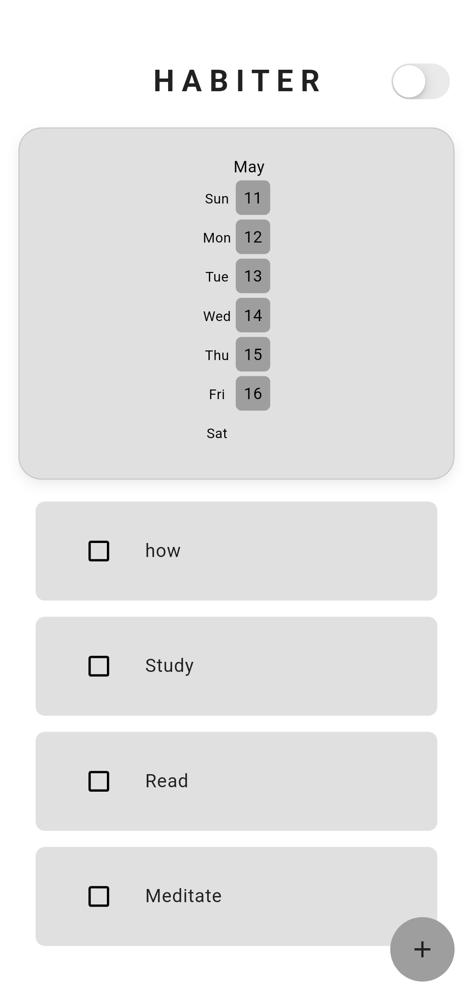
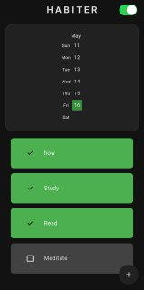
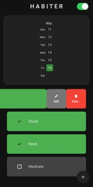

# 🌟 Habiter -- Your Personal Habit Tracker

> *Track. Transform. Thrive.*
> A minimalist, efficient Flutter app to build better habits every day.

 <!-- Optional: Replace with your banner image -->

---

## 🚀 Features

- ✅ **Create & Track Habits**
  Quickly add new habits, mark completion, and track progress over time.

- 📆 **Heatmap Visualization**
  See your consistency with a beautiful heatmap that grows with your efforts.

- ✏️ **Edit & Delete Habits**
  Manage your habits easily with intuitive dialogs.

- 🌗 **Dark Mode Support**
  Seamless switching between light and dark themes.

- 💾 **Offline-First with Hive DB**
  Fully functional without internet --- data is stored locally.

- 💡 **Simple, Clean UI**
  Inspired by modern design principles -- elegant and distraction-free.

---

# Screenshots from the App

**Home Screen (Light Mode)**  


**Dark Mode**  


**Edit/Delete Habit**  


---

## 🧠 Built With

- [Flutter](https://flutter.dev) -- Cross-platform UI toolkit
- [Hive](https://docs.hivedb.dev) -- Lightweight NoSQL DB
- [Provider](https://pub.dev/packages/provider) -- State management
- [flutter_native_splash](https://pub.dev/packages/flutter_native_splash)
- [flutter_launcher_icons](https://pub.dev/packages/flutter_launcher_icons)

---

## 📦 Installation

### 🔧 Prerequisites
- Flutter SDK (≥ 3.x)
- Android Studio or VSCode

### 🛠️ Run Locally

```bash
git clone https://github.com/ronnie-allen/Habiter-Flutter.git
cd habiter
flutter pub get
flutter run

```

* * * * *

📁 Folder Structure
-------------------

```
lib/
├── components/         # Reusable widgets
├── database/           # Hive logic
├── dialogs/            # Alert dialogs (create, edit, delete)
├── models/             # Habit model
├── theme/              # Theme management
├── utils/              # Helper functions
└── main.dart           # Entry point

```

* * * * *

🧩 Contributions
----------------

Contributions, issues, and feature requests are welcome!\
Feel free to fork and submit PRs.

* * * * *

📜 License
----------

This project is licensed under the MIT License - see the [LICENSE](LICENSE) file for details.


* * * * *

🙌 Acknowledgements
-------------------

-   Inspired by the power of consistency 🧠

-   Thanks to the Flutter & Hive communities ❤️

* * * * *
## 📦 Download & Explore

You can download the latest APK and explore the application from the [Releases](https://github.com/ronnie-allen/Habiter-Flutter/releases) section.

👉 [Click here to go to Download](https://github.com/ronnie-allen/Habiter-Flutter/releases)

Once downloaded, install the APK on your Android device and start tracking your habits with ease!


📬 Contact
----------

Have suggestions or feedback?\
📧 Email: ronnieallen2005@gmail.com\
📱 LinkedIn: [linkedin.com/in/ronnie-a-jeffrey](https://linkedin.com/in/ronnie-a-jeffrey-0901b22bb)

* * * * *

> *"We are what we repeatedly do. Excellence, then, is not an act, but a habit." -- Aristotle*

